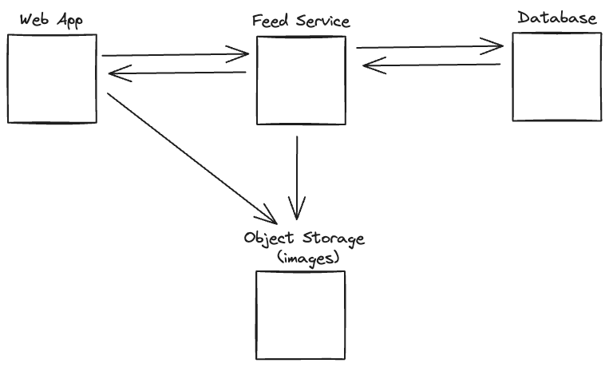
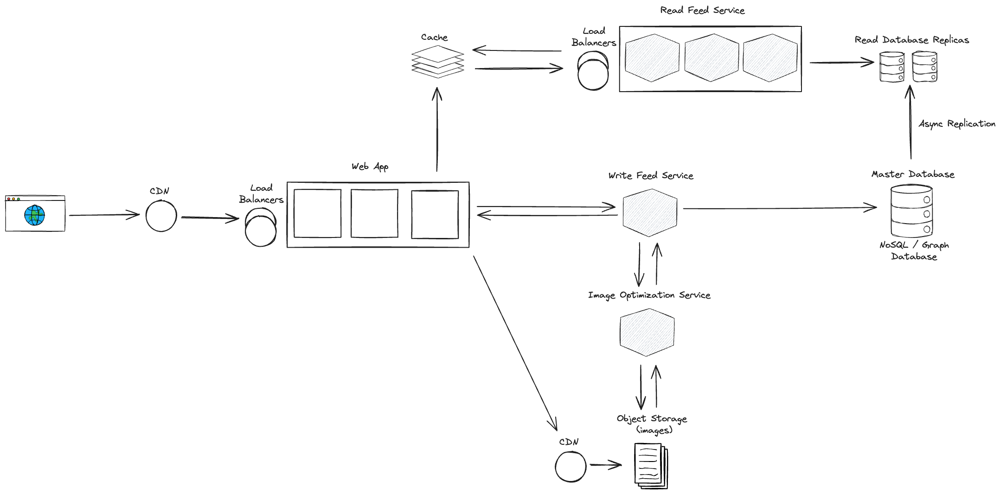
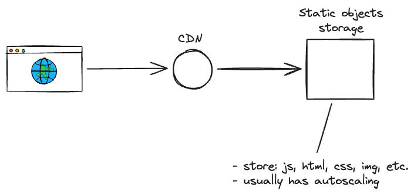
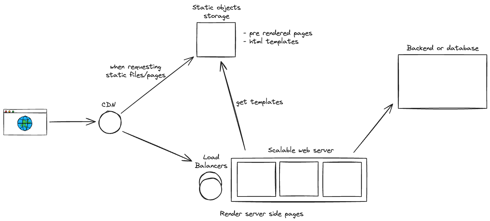

# System Design Cheat Sheet

## 1. Requirements Gathering

- Ask about the constraints and the scale of the system.
- Ask about the data storage requirements.
- Ask about the availability requirements.
- Ask about the latency requirements.
- Ask about the reliability requirements.
- How many users are there?
  - How many requests per second can you handle?
  - What is the read to write ratio?
- Where are the users located?
- What are the peak and off-peak hours?

## 2. Minimum Architecture Drawing

- Sketch the important components and connections between them, but don't go into some details.
  - Client / Server
  - Application service layer (serves the requests)
  - List different services required.
  - Data Storage layer

## 3. Scale the system

- Talk about horizontal and vertical scaling.
  - Horizontal scaling: Add more servers (more machines)
  - Vertical scaling: Add more resources to the existing servers (CPU, RAM, etc.)
- Scale the client side
- Scale the server side (Application service layer and Data Storage layer)
- Scale the client side
  - Use CDN
  - Use caching
  - Use compression
  - Use load balancing
  - Use reverse proxy
- Scale the server side
  - Separate the services
  - Cache
  - Load Balancer
  - Multiple servers
  - Multiple databases

## 4. Understand the trade-offs and bottlenecks

- Talk about the trade-offs and bottlenecks of the system.
- Iterate on the architecture drawing.

## 5. Design Patterns (Optional)

- Talk about the design patterns that can be used in the system.

## 6. Frontend Specific - Deep dive into the Web App part

- Let's divide the frontend system design into two parts:
  - Application solution level
  - Component level
- Talk about the rendering strategy
  - Client side rendering
  - Server side rendering
  - Static site generation
- Which deployment strategy to each rendering strategy
- Monitoring and observability
- Talk about bundling optimizations
  - Tree shaking
  - Code splitting
  - Lazy loading
- Talk about image optimizations
  - Compress images
  - Use responsive images
  - Cache images
- Talk about caching strategies
  - Client side caching
  - Server side caching
  - Edge caching
  - CDN caching
  - Service worker caching / offline capabilities
- Talk about api calls optimizations and caching
  - Ex: Use caching to avoid calling the same api again and again.
  - Ex: RTK Query, React Query, etc.
- Possibility to use micro frontends
- Virtualization / Windowing for large lists
- Mobile first or desktop first?
- Accessibility

### 6.1 Application solution level - Client side rendering or SSG

### 6.2 Application solution level - Server side rendering + SSG

- In this application, the webserver is responsible for getting all the information needed by the template, and then get and compose the template before sending the response to the client.
- On the drawing, only the web server is communicating with backend or database, because at request time, the web server is the only resource able to do so. The client side can communicate with the backend too, but it is not on request time, it is on the client side.
- We can improve this architecture, using serverless functions, etc, but the core idea is to have a web server that can communicate with the backend and the database, and then compose the template before sending the response to the client.

### 6.3 Component level

TODO: Create the drawing for the component level.

---

## Key topics for designing a system

1. Concurrency

Do you understand threads, deadlock, and starvation? Do you know how to parallelize algorithms? Do you understand consistency and coherence?

2. Networking

Do you roughly understand IPC and TCP/IP? Do you know the difference between throughput and latency, and when each is the relevant factor?

3. Abstraction

You should understand the systems you’re building upon. Do you know roughly how an OS, file system, and database work? Do you know about the various levels of caching in a modern OS?

4. Real-World Performance

You should be familiar with the speed of everything your computer can do, including the relative performance of RAM, disk, SSD and your network.

5. Estimation

Estimation, especially in the form of a back-of-the-envelope calculation, is important because it helps you narrow down the list of possible solutions to only the ones that are feasible. Then you have only a few prototypes or micro-benchmarks to write.

6. Availability & Reliability

Are you thinking about how things can fail, especially in a distributed environment? Do know how to design a system to cope with network failures? Do you understand durability?

## Thanks and credits

- [Vasanthk System Design Cheatsheet](https://gist.github.com/vasanthk/485d1c25737e8e72759f)
- [Frontend System Design Interview (Build Instagram)](https://www.youtube.com/watch?v=_HjRSHeQ92k&t=671s)
